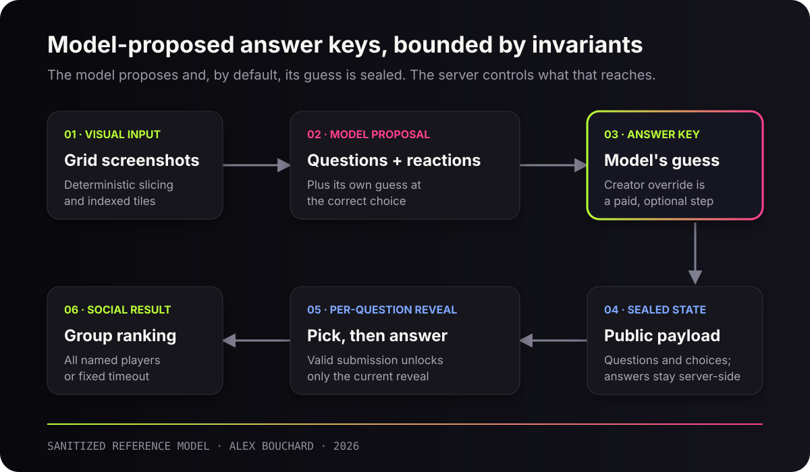

# That's My Best: Model-Proposed Answer Keys Under Machine-Checkable Invariants

[](https://github.com/abouchard11/thats-my-best-engineering-case-study/actions/workflows/ci.yml)

**Screenshots in. A playable social memory test out.**

[Live product](https://thatsmybest.com/) ·
[iPhone app](https://apps.apple.com/us/app/thats-my-best-ai-friend-quiz/id6788340469) ·
[Engineering workfolio](https://midnightdev.dev/build-room) ·
[Product case study](https://midnightdev.dev/work/thatsmybest)

> **Generate boldly. Validate cheaply. Kill ruthlessly. Scale what survives.**

My operating rule is simple: models propose and challenge; explicit authority
boundaries and machine-checkable invariants decide what ships. A human review
step is worth building, but it is not what a system can rely on, because the
fastest path through any product is the one that skips it.

That's My Best turns one to four social-grid screenshots into a five-question
friend quiz. A multimodal model proposes visual evidence, questions, choices,
and character reactions — and on the free default path its own guess becomes
the answer key at seal time. The creator sees the proposals at a glance and
sends. Per-question correction tools ship as a paid upgrade ("Pick Your Own",
$4.99), not as a required step.

That makes the defining design problem the one worth writing down:

> **The model's guess ships as the answer key by default. What bounds a wrong
> one is the code around it: no answers in the player payload, reveal only after
> a valid pick, an immutable seal, and scores only for players who actually
> played.**

## Public disclosure

This is a **sanitized engineering case study and executable reference model**,
not the private production source. It preserves the authority boundaries that
matter while withholding prompts, credentials, user content, provider wiring,
private analytics, and operational defenses.



## What the code proves

These hold on every quiz, whether or not a human touched the answer key:

| Invariant | Reference implementation | Test |
|---|---|---|
| Player payloads do not contain answers | `publicQuizPayload` copies only prompts and choices | Payload serialization rejects private fields |
| Answers appear only after a valid pick | `revealAfterPick` validates question and choice IDs | Invalid-choice probing fails |
| Sealed state is immutable through the correction API | Corrections accept draft state only | Post-seal correction fails |
| Group reveal has deterministic completion rules | `groupRevealStatus` waits for named players or a fixed deadline | Completion and timeout paths are tested |
| Missing players never receive invented scores | Timeout ranking uses submitted attempts only | Partial ranking stays partial |

### Optional capability: creator correction

Correction is a real code path, not a required one.

| Capability | Reference implementation | Test | When it runs |
|---|---|---|---|
| A creator can replace the model's proposed key before sealing | `applyCreatorCorrections` changes the canonical key, marks `sourceOfTruth: "creator"`, and queues focused rewrites | Corrected key controls the sealed reveal | Only when the creator buys the correction tools; the free default path seals the model's own guess |

The production flow names these two modes explicitly in its own seal-time
analytics: `trust_his_guesses` (default) and `pick_your_own` (paid).

## Product loop

1. The creator supplies one to four grid screenshots.
2. A deterministic image pipeline indexes the visible tiles.
3. The multimodal model proposes questions and reactions from those tiles,
   and records its own guess at the answer for each one.
4. **Default path:** the creator glances at the proposals and seals. The model's
   guess becomes the canonical answer key with no per-question step.
   **Paid override:** a creator who has bought the correction tools can swap the
   tile, edit the wording, reroll, cut a question, or set a different key, and
   the changed questions get a focused comedy rewrite around the new truth
   before sealing.
5. The sealed public payload excludes answers and creator-only material.
6. Each valid player pick unlocks only that question's reveal.
7. Named-player completion or a fixed deadline releases the group result.

The production system adds image processing, storage, moderation, analytics,
payments, anti-abuse controls, and native-app integration. Those details are
outside this public disclosure.

## Evidence snapshot

Verified on **2026-08-04** against the production source.

- The product is live on the web and in the Apple App Store.
- Apple lists **Alex Bouchard** as the developer.
- Public product copy documents the one-to-four-screenshot input, five-question
  output, and one-to-three-friend social loop.
- The free creation path seals the model's proposed answer key. The in-product
  copy on that screen says so directly: a mismatch between question and photo is
  "Yapoleon guessing wrong — not a glitch," and correction is what the upgrade
  buys.
- Per-question correction tools are a $4.99 in-app purchase, priced on the
  creation screen.
- Early soft-launch generation cost measured roughly **6–7¢ per completed
  quiz**. That is a cost observation, not a traction claim.

See the [evidence ledger](docs/evidence-ledger.md) for sources and
qualifications.

## Run the reference model

Requires Node.js 20 or newer. It has no runtime dependencies.

```bash
npm test
```

## Repository map

```text
src/reference-model.mjs       Authority-boundary reference implementation
tests/reference-model.test.mjs
docs/architecture.md          System and trust-boundary explanation
docs/evidence-ledger.md       Public claims and qualifications
docs/privacy-and-safety.md    Disclosure and safety boundaries
```

## Why this belongs in an applied-AI workfolio

The hard part was not calling a vision model. It was deciding what a
probabilistic system may suggest, what the player may receive, which state
transitions must remain deterministic, and how much of that can survive the
human step being optional.

A guarantee that depends on someone choosing the slower path is not a
guarantee. The invariants above are the ones that still hold at 3am on the free
tier, and they are the reason a wrong guess costs a friend an eye-roll instead
of corrupting the sealed record, leaking the rest of the answers, or inventing a
score for someone who never played.

That pattern carries into any AI product where a fluent output can be mistaken
for truth.

---

Designed and authored by **Alex Bouchard**, solo founder and applied AI product
engineer in Houston, Texas.
